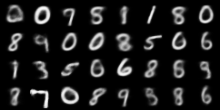

# Variational Auto Encoder (VAE)
A simple VAE implementation.

pip install -r requirements.txt to install environment

Usage: python run.py [arguments]

(python run.py --help for help)

Training results:

1 epoch

10 epochs

20 epochs

40 epochs